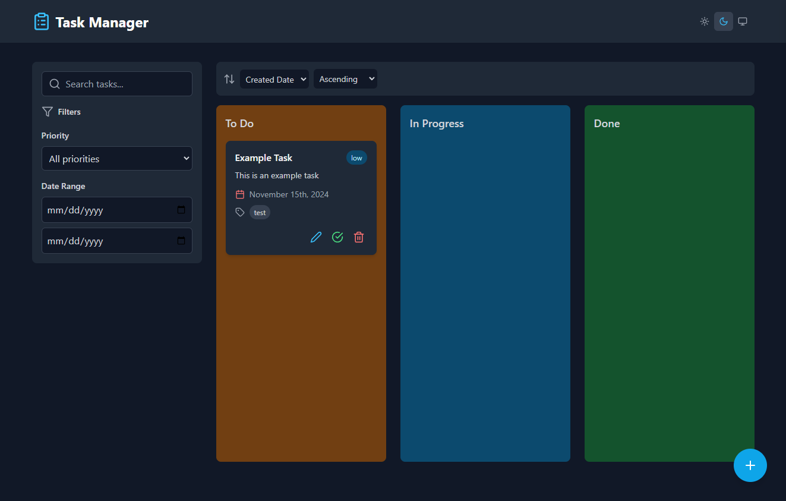

# Kanban Task Manager

A sleek and intuitive **To-Do Task Manager** using the **Kanban model**, built with **React** and powered by **Vite**. Organize your tasks visually, track progress effortlessly, and boost productivity!



## Features

- **Kanban Board**: Organize tasks into customizable columns (e.g., To Do, In Progress, Done).
- **Task Management**: Add, edit, delete, and move tasks between columns with ease.
- **Drag and Drop**: Intuitive drag-and-drop functionality for task management.
- **Responsive Design**: Fully responsive, works seamlessly on desktops, tablets, and mobile devices.
- **Fast Performance**: Built with Vite for optimized build speed and runtime performance.
- **Modern UI**: Clean and minimal design for a distraction-free experience.
- **Dark Mode!**: Toggle dark mode so the UI is easier on your eyes in the dark, or if you just prefer it. It goes by your browser settings by default.

## Technologies Used

- **React**: Component-based UI development.
- **Vite**: Fast and lightweight development environment.
- **Tailwind CSS**: For modular and customizable styling.
- **React DnD**: Drag-and-drop functionality.

## Installation

Follow these steps to get the Kanban Task Manager running on your local machine:

### Prerequisites
- [Node.js](https://nodejs.org/) (v16 or higher recommended)
- [Git](https://git-scm.com/)

### Steps
1. **Clone the Repository**
   ```bash
   git clone https://github.com/chasecurtis1991/todo-kanban.git
   cd todo-kanban
   ```

2. **Install Dependencies**
   ```bash
   npm install
   ```

3. **Run the Development Server**
   ```bash
   npm run dev
   ```

4. Open your browser and navigate to `http://localhost:5173`.

## Usage

1. Add new tasks to any column by clicking the **+** button on the bottom-right.
2. Drag tasks between columns to update their status.
3. Edit or delete tasks using the task options. **Note: non-recurring tasks auto-delete after 10 seconds when completed!**

## Contributing

Contributions are welcome! If you'd like to add features or fix issues:

1. Fork the repository.
2. Create a new branch: `git checkout -b feature/your-feature-name`.
3. Make your changes and commit them: `git commit -m "Add your feature"`.
4. Push the branch: `git push origin feature/your-feature-name`.
5. Open a pull request.

## License

This project is licensed under the [GNU GPLv3 License](LICENSE).

## Acknowledgments

- Inspiration: The Kanban methodology and modern task management tools.
- Libraries and frameworks: React, Vite, and various open-source dependencies.

---

Feel free to reach out for suggestions, questions, or feedback! 😊
``` 